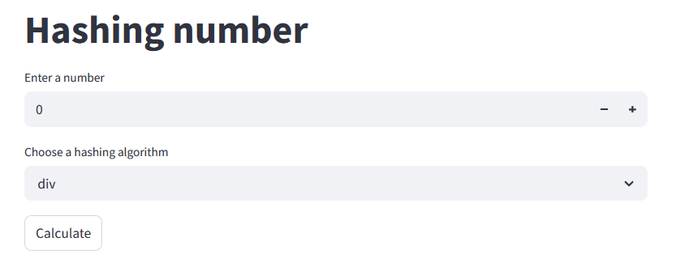
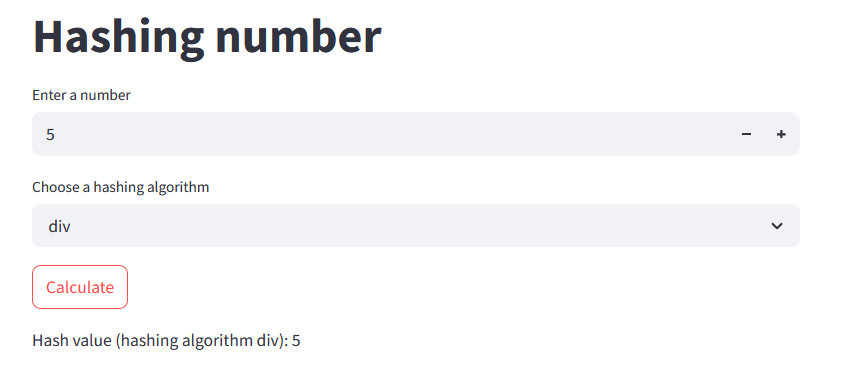
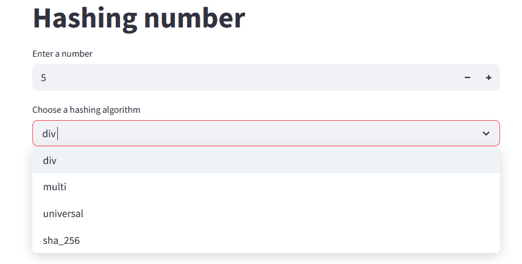

## Hash project

### Contents

1.  [Deployment](#deployment)
2.  [General Description](#general-description)
3.  [The Division Method](#the-division-method)
4.  [The Multiplication Method](#the-multiplication-method)
5.  [The Universal Method](#the-universal-method)
6.  [SHA-256 Hashing](#sha-256-hashing)
7.  [Programs](#programs)

### Deployment

The easiest way to deploy this project is to use Docker Compose.

1.  Make sure Docker and Docker Compose are installed on your server.

2.  Ensure that the `make` command is installed in your system's environment variables.  If you haven't installed `make` yet, follow these instructions:

    *   **For Windows:** Follow the instructions on this website: [https://www.thewindowsclub.com/install-and-run-makefile-on-windows](https://www.thewindowsclub.com/install-and-run-makefile-on-windows).  This usually involves installing MinGW or a similar toolchain, and then adding the directory containing `make` (usually `C:\MinGW\bin` or similar) to your system's `PATH` environment variable.
    *   **For macOS and Linux:** `make` is typically pre-installed or easily installed using your system's package manager (e.g., `apt install make` on Debian/Ubuntu, `brew install make` on macOS).

2.  Clone the repository:

    ```bash
    git clone https://github.com/Alatin-sergey/hash_project.git
    cd hash_project
    ```

3. Ensure that Docker Desktop is running on your system. 

4. Run the project using makefile `makefile`:

    ```bash
    make -f makefile
    ```

5.  Open the Streamlit application in your browser at `http://localhost:8501`. This port is used for the user interface.
    Access the FastAPI API at `http://localhost:8000`. This port is used for the backend API.

6. To stop makefile use:

    ```bash
    make -f makefile down
    ```
    

7. To clean server from Docker Desctop:
   
    ```bash
    make -f makefile clean
    ```
    
    **Warning:** This command will remove all unused Docker images and volumes. Be careful when using it.

9.  For more information about available commands, use:
    
    ```bash
    make -f makefile help
    ```

### General description

This project demonstrates skills in working with hashing of digital values. It uses four types of hashing algorithms:
1. The division method
2. The multiplication method
3. The universal method
4. SHA-256 hashing

### The Division Method

This method uses the following formula:

$$h(k) = k\ mod\ m$$

where:

* $k$ - target value for hashing, 
* $m = 19$ - is the simulated hash table size.

Therefore, the hash table will have 19 cells for hash values.

### The multiplication method

This method uses the following formula:

$$h(k) = \lfloor m \cdot (A \cdot k\ mod\ 1) \rfloor$$

where:
* $A = \frac {\sqrt 5 - 1} {2}$ - a constant of multiplication method, 
* $k$ - target value for hashing, 
* $m = 19$ - imitation of hash-table size.

### The universal method

This method uses two contants:

1. $a = \text{random}(1 \dots p-1)$
2. $b = \text{random}(0 \dots p-1)$

where $p$ is the next prime number after $m$ ($m = 19$).

And final formular is:

$$h(k) = ((a \cdot k + b)\ mod\ p)\ mod\ m$$

where:

* $k$ - target value for hashing, 
* $m = 19$ - imitation of hash-table size.

### SHA-256 Hashing

This is a standard hashing algorithm from the Python `hashlib` library. The result of this hash is a unique key of constant length.

### Programs

The project consists of two programs: a backend and a frontend, both written in Python. The backend program accepts requests from the frontend Streamlit program and returns the hash value.

Here are some screenshots of the service:






